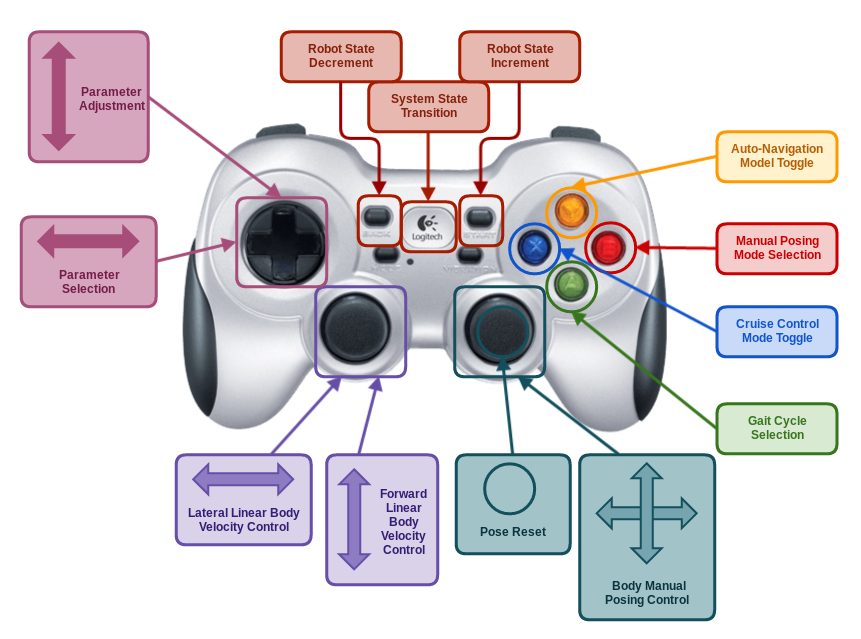

# How to Control the Legged Robot

[Back to the main page](README.md)

## Basic Control

### Start-Up Procedure

LOGITECH -> START -> START

### Linear Movements

* Left joystick up - move forwards
* Left joystick down - move backwards
* Left joystick left - stride left
* Left joystick right - stride right

### Angular Movements

* Right joystick left - rotate anticlockwise
* Right joystick right - rotate clockwise

## Button Functionality

* __System State Transition:__
  Controls OpenSHC system state. Press to start/suspend/resume control.

* __Robot State Increment:__
  Increments robot state. Press to transition forward through possible robot states. (i.e. PACKED->READY->RUNNING)

* __Robot State Decrement:__
  Decrements robot state. Press to transition backward through possible robot states. (i.e. RUNNING->READY->PACKED)

* __Gait Cycle Selection:__
  Cycles through possible gait selections defined in config/gait.yaml. (defaults include Wave, Amble, Ripple and Tripod)
  
* __Manual Posing Mode Selection:__
  Cycles through manual body posing modes. Use the right joystick for adjusting the pose.

  * NO POSING: No posing input.
  * X Y POSING: Linear translational posing in the x-axis and y-axis of the robot frame.
  * PITCH ROLL POSING: Angular rotational posing about he x-axis (roll) and y-axis (pitch) of the robot frame.
  * Z YAW POSING: Right Linear translational posing in the z-axis and angular rotational posing about the z-axis (yaw) of the robot frame.
  * EXTERNAL POSING: Posing input from external source

* __Cruise Control Mode Toggle:__
  Starts/Stops cruise control mode. Cruise control sets a constant input velocity dependent on the parameter values defined in config/hexapod.yaml

* __Auto-Navigation Mode Toggle:__
  Starts/Stops auto navigation mode. Auto navigation required correct sensing capabilities and syropod auto navigation.

* __Pose Reset Mode:__
  Reset all current body poses to zero. (according to current posing mode)

* __Parameter Selection:__
  Cycles through possible adjustable parameter selections.

* __Parameter Adjustment:__
  Adjusts selected parameter by incrementing/decrementing according to adjustment step amount defined in config/hexapod.yaml.
  
  [Back to the main page](README.md)

