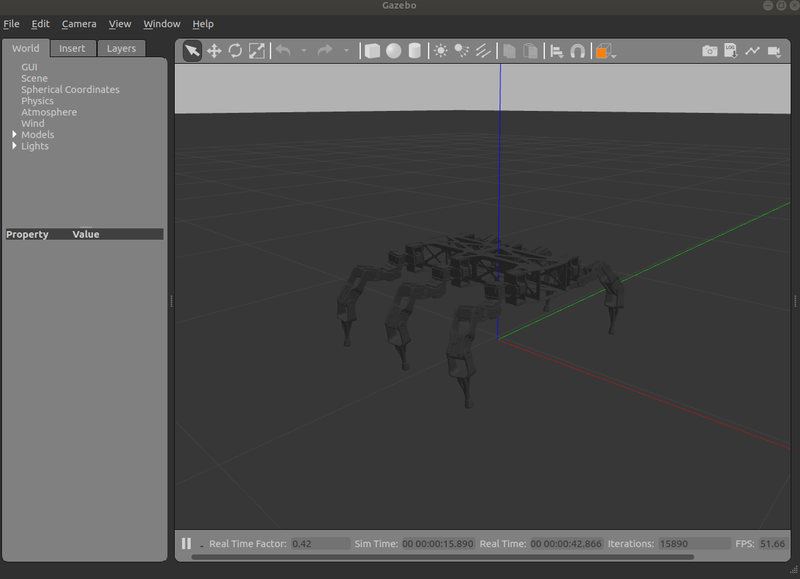
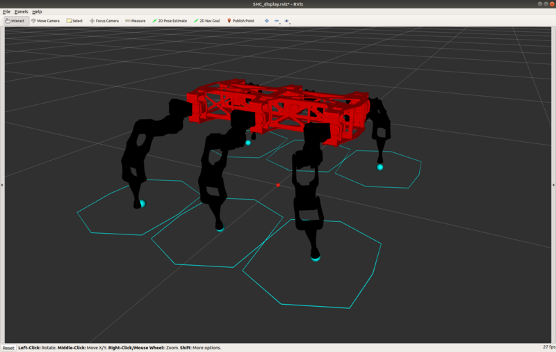

# 4. Simulating in the Gazebo Simulation Environment

[Previous: Creating the Catkin Workspace](shc_pc_create_workspace.md)

To simulate a hexapod in the Gazebo simulation environment, you have to create the required graphical objects. (URDF files, xacro files, Gazebo worlds etc...) You can clone the bullet syropod package which contains the required graphical objects for the syropod named bullet syropod.

4.1 Open the src folder in the created workspace by,

```bash
cd ~/openshc_ws/src
```

4.2 Clone the bullet syropod package to the src folder in your workspace by,

```bash
git clone https://github.com/csiro-robotics/bullet_syropod.git
```

4.3 Open your workspace by,

```bash
cd ~/openshc_ws
```

4.4 Compile your workspace by,

```bash
catkin build
```

4.5 Source the devel/setup.bash file from your workspace by,

```bash
source ~/openshc_ws/devel/setup.bash
```

4.6 Plug the gamepad into your machine. We use a Logitech Wireless Gamepad (F710) for control. Other gamepads may be used, but the mapping may differ.

4.7 Launch the Gazebo simulation from the terminal by,

```bash
roslaunch bullet_syropod bullet_highlevel.launch gazebo:=true
```

4.8 Start the simulation by clicking the play button on the Gazebo environment.



4.9 Press the Logitech button after acquiring the robot state and press the start button to change it to the running state.

4.10 After generating the workspace press the start button again to proceed.

4.11 Visit [How to Control the Hexapod](shc_guide_hexapod.md) to learn how to control the hexapod from the joystick.

* This simulation displays the Bullet Syropod. For other syropods you have to modify the configuration file `~/openshc_ws/src/<name_syropod>/config/<name>.yaml` accordingly and simulate them in the Rviz environment by the following command.

  ```bash
    roslaunch <name_syropod> <name>_highlevel.launch rviz:=true
  ```



* You can simulate any syropod in the Rviz environment just by changing the configuration parameters in `~/openshc_ws/src/<name_syropod>/config/<name>.yaml` according to the syropod. However to simulate in the Gazebo simulation environment, you have to create the required model for that specific syropod. (URDF files, xacro files, Gazebo worlds etc...)

[Next: Preparing the Hexapod](shc_pc_prepare_hexapod.md)
