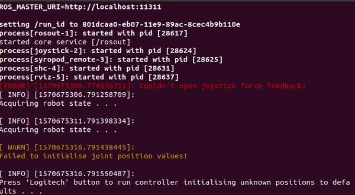

# 6. Launching OpenSHC

[](https://research.csiro.au/robotics/)

[Previous: Preparing the Legged Robot](shc_pc_prepare_hexapod.md)

After preparing the legged robot, you can now launch the ROS launch files and run OpenSHC with the real legged robot.

6.1 Source the devel/setup.bash file from your workspace if it is not added to the .bashrc file.

```bash
source ~/openshc_ws/devel/setup.bash
```

6.2 Turn on the switch of the robot so that the motors are powered up and make sure the USB2Dynamixel or USB2ax converter is connected to your computer.

6.3 Give read/write access to the relevant port (ttyACM0 should be replaced with your matched port if necessary) by,

```bash
  sudo chmod 666 /dev/ttyACM0
```

6.4 First launch the Syropod Hardware Controller launch file from the terminal by,

```bash
roslaunch frankenX_syropod frankenX_hardware.launch
```

6.5 Make sure that the all motors are identified with their relevant IDs and all controllers have been started.

6.6 Launch the Syropod Highlevel Controller from another terminal window by,

```bash
roslaunch frankenX_syropod frankenX_highlevel.launch
```

* You can add the following arguments to run the syropod high-level controller with additional features. However to simulate in the Gazebo simulation environment, you should have created the required model before. (URDF files, xacro files, Gazebo worlds etc...) Below are the default values for optional high-level arguments.

  * Default Configuration: `config:=syropod` (loads syropod.yaml for OpenSHC)
  * Gait Parameters: `gait:=gait` (loads gait.yaml for OpenSHC)
  * Auto-Pose Parameters: `auto_pose:=auto_pose` (loads auto_pose.yaml for OpenSHC)
  * Control input method: `control:=joy` ('rqt' to use rqt reconfigure control; 'key' to use keyboard)
  * RVIZ Visualisation: `rviz:=true`
  * Gazebo Simulation: `gazebo:=false`
  * RQT Plot: `plot:=false`
  * RQT Reconfigure: `reconfigure:=false`
  * Auto-Logging: `logging:=false`

* To run the default without visualisation but with logging,

```bash
  roslaunch frankenX_syropod frankenX_highlevel.launch rviz:=false logging:=true
```

6.7 The system is initially at suspended state.



6.8 Press the Logitech button after acquiring the robot state to change the system state to operational.


6.9 Press the start button to change the robot state to ready state.


6.10 Press the start button again to change the robot state to running state.


6.11 When the workspace is generated and the robot is ready to walk you can control the robot from the joystick. Visit [How to Control the Legged Robot](shc_guide_hexapod.md) to learn how to control the legged robot from the joystick.

* You can use syropod rqt reconfigure control GUI to control the robot instead of syropod remote. See [How to use Syropod RQT Reconfigure Control](shc_rqt_reconfigure_control.md) for more details.

[//]: # (Insert the embedded link of PhantomX implementation with PC.mp4 here)

6.12 See [Troubleshooting](troubleshooting.md) if you encounter with any problems.

6.13 Before tuning with different parameters please make a copy of the desired parameter file (e.g. gait_experimental.yaml in the ~/openshc_ws/src/frankenX_syropod/config folder) and make changes there. In order to use the new parameter file launch the high-level controller with the specific argument set to the new parameter file.

```bash
roslaunch frankenX_syropod frankenX_highlevel.launch gait:=gait_experimental
```

* Tuning of high-level parameters is done using the following parameter files.

  * Syropod Parameters - `arg=config`
    * `~/openshc_ws/src/frankenX_syropod/config/frankenX.yaml`
  * Gait Cycle Parameters - `arg=gait`
    * `~/openshc_ws/src/frankenX_syropod/config/gait.yaml`
  * Auto Posing Cycle Parameters - `arg=auto_pose`
    * `~/openshc_ws/src/frankenX_syropod/config/auto_pose.yaml`

* Consult [OpenSHC config](https://github.com/csiro-robotics/syropod_highlevel_controller/tree/master/config) for details.

[Back to Implementing OpenSHC on a PC](shc_pc.md)
