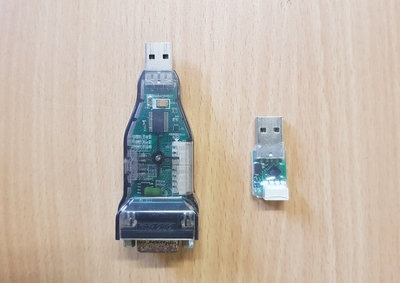
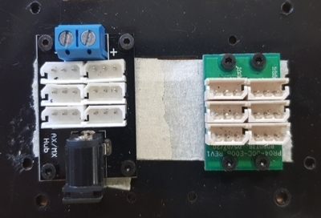

# 5. Preparing the Hexapod

[Previous: Simulating in Gazebo Simulation Environment](shc_pc_gazebo_simulation.md)

Before launching the SHC launch files, you have to follow these steps with the hexapod.

5.1 Connect the dynamixel motors in your hexapod appropriately using the suitable wires and hubs (TTL 3 pin wires for AX-12A motors).

5.2 Connect the TTL to USB dynamixel converter to your hexapod.

5.3 Connect power to the motors by using a suitable 12V power source like a Li-Po battery with a switch and a hub (Don't turn on the switch).

 

5.4 Plug the joystick into your machine.

5.5 Plug the TTL to USB dynamixel converter into your machine. It is better to use a long USB extension cable such that the hexapod has space to operate.

5.6 Modify the Syropod configuration file (syropod.yaml) according to the hexapod parameters. The important parameters are the DH parameters of the hexapod links, body clearance (height from the floor to the body), desired leg stance positions. See [SHC config](https://github.com/csiro-robotics/syropod_highlevel_controller/tree/master/config) for more information.

5.7 Modify the motor configuration file (syropod_motors.yaml) such that the motor IDs of the actual motors match with the desired convention. You can check the IDs of motors by the tool Dynamixel Wizard in RoboPlus software in Windows.

 

[Next: Launching SHC](shc_pc_launch_shc.md)
