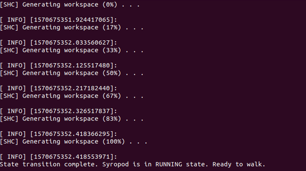

# 7. Launching SHC

[](https://research.csiro.au/robotics/)

[Previous: OPTIONAL: Setting Up SHC to Run at Launch](shc_raspi4_run_at_launch.md)

After preparing the legged robot, you can launch the ROS launch files and run SHC on the real legged robot.

7.1 Power on the legged robot to power the motors and the Raspberry Pi.

7.2 Allow some time for the Pi to boot and connect to the robot's hotspot.

7.3 SSH into the Raspberry Pi from your PC or laptop by,

```bash
ssh username@ip-address
# Here username should be the username of the Raspberry Pi (default is pi) and ip-address should be the one set in step 5
```

7.4 Enter your log in details and log in to the Raspberry Pi.

7.5 Source the devel/setup.bash file from your workspace if it is not added to the .bashrc file.

```bash
source ~/openshc_ws/devel/setup.bash
```

7.6 First launch the Syropod Hardware Controller launch file from the terminal by,

```bash
roslaunch frankenX_syropod frankenX_hardware.launch
```

7.7 Make sure that the all motors are identified with their relevant IDs and all controllers have been started.

7.8  kill the process by "CTRL+C" and launch both the Syropod Hardware Controller and the Syropod Highlevel Controller from the terminal at once by,

```bash
roslaunch frankenX_syropod frankenX_start.launch
```

7.9 The system is initially in a suspended state.


7.10 Press the Logitech button after acquiring the robot state to change the system state to operational.


7.11 Press the start button to change the robot state to ready state.


7.12 Press the start button again to change the robot state to running state.



7.13 When the workspace is generated and the syropod is ready to walk you can control the hexapod from the joystick. Visit [How to Control the Legged Robot](shc_guide_hexapod.md) to learn how to control the hexapod from the joystick.

7.14 See [Troubleshooting](troubleshooting.md) if you encounter any problems.

[Back to Implementing SHC on a Raspberry Pi 4](shc_raspi4.md)
