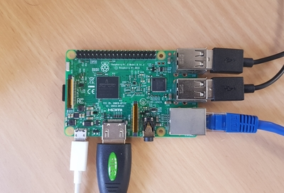

# 2. Booting the Raspberry Pi

[Previous: Flashing Ubuntu Server 18.04](shc_raspi_flash_ubuntu.md)

After flashing the Ubuntu Server 18.04 image to the SD card, you can boot the Raspberry Pi 3 as follows.

2.1 Connect a mouse and keyboard to the Raspberry Pi 3 via USB.

2.2 Connect a monitor or a HDMI supported screen to the HDMI port of the Raspberry Pi using a HDMI cable.

2.3 For installing ROS and other required packages you need to connect the Raspberry Pi to the internet. Connect the Raspberry Pi into a router or any other suitable networking device with a working internet connection using an ethernet cable.

2.4 Use a 5V adapter to supply power to the board (micro USB phone chargers may work as well) and boot the system.



2.5 The default username is ubuntu and the default password is ubuntu as well.

2.6 Change the password on the first login as you wish.

2.7 Run the following commands to ensure that the Raspberry Pi has obtained an IP address and has a working internet connection.

```bash
ifconfig
ping www.google.com
```

[Next: Installing ROS](shc_raspi_install_ros.md)
