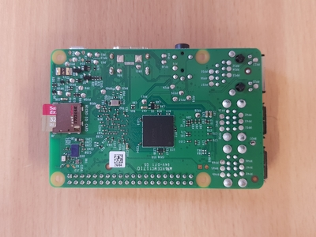

# 1. Flashing Ubuntu Server 18.04

[Back to Implementing OpenSHC on a Raspberry Pi 3](shc_raspi.md)

The first step of implementing OpenSHC on a Raspberry Pi 3 is to flash Ubuntu Server 18.04 image to the Raspberry Pi 3. The following steps will help you to download and flash a Ubuntu Server 18.04 image to a SD card.

1.1 Download the Ubuntu Server 18.04 image for [Raspberry Pi 3](https://wiki.ubuntu.com/ARM/RaspberryPi). (Ubuntu Server 18.04.3 arm64 image for Raspberry Pi 3B/3B+)

1.2 Extract the image file (.img) from the archived file.

1.3 Download and install [Etcher](https://www.balena.io/etcher/). (You can use any other suitable software as well)

1.4 Obtain an SD card. (32GB or above is recommended)

1.5 Connect it into a PC and format it. (FAT 32 if less than 32GB and exFAT if more than 32GB)

1.6 Select the extracted image file and flash it to the SD card using Etcher. See this [guide](https://www.raspberrypi.org/magpi/pi-sd-etcher/) for more information.

1.7 Remove the SD card from the computer.

1.8 Insert the SD card into the Raspberry Pi 3 board.

[Next: Booting the Raspberry Pi](shc_raspi_boot_raspi.md)
