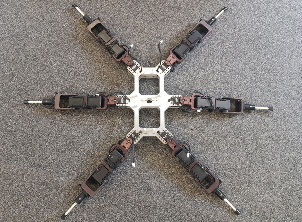
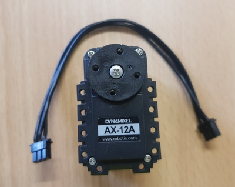
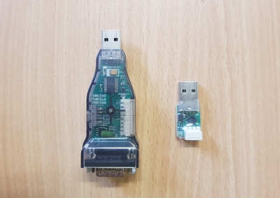
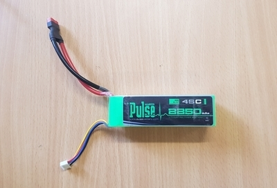
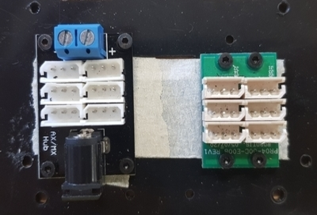
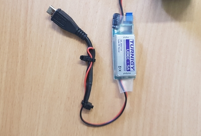
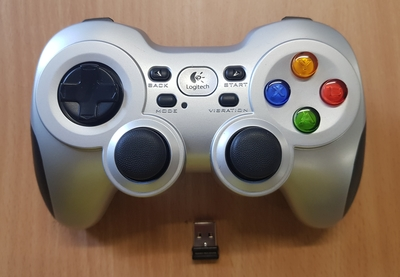
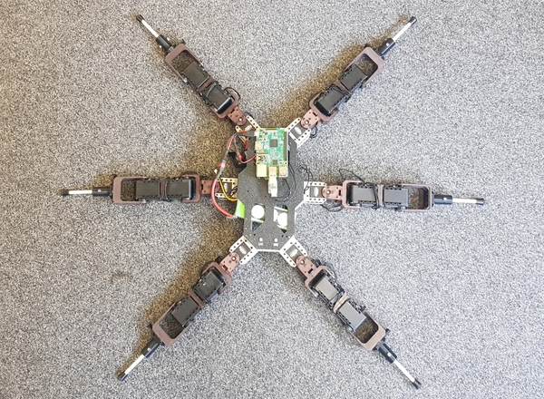

# 9. Preparing the Legged Robot

[Previous: Enabling SSH](shc_raspi_enable_ssh.md)

Before launching the SHC launch files, you have to follow these steps with the legged robot. Here we are using a slightly modified [Trossen Robotics PhantomX mk 1 hexapod robot](https://www.trossenrobotics.com/phantomx-ax-hexapod-mk1.aspx). The following image shows the robot before connecting the servo cables to the hub.

9.1 Connect the dynamixel motors of the robot appropriately using the suitable cables and hubs (TTL 3 pin cables for AX-12A motors).

9.2 Connect a [USB2Dynamixel converter](https://www.trossenrobotics.com/robotis-bioloid-usb2dynamixel.aspx) or an equivalent converter such as the [USB2ax converter](https://www.seeedstudio.com/USB2AX-p-1349.html) that converts from TTL (or RS485 if you are using different series of Dynamixel servos) to USB to your robot.

9.3 Connect power to the motors by using a suitable power source (e.g: 3 cell Li-Po battery or 12V power supply with sufficient current output) with a switch and a hub (Don't turn on the switch). 

 

9.4 Connect power to the Raspberry Pi using the same battery and switch and use a 5V regulator with sufficient current capacity (2.5A or more) with a micro USB adapter in between the battery and the Raspberry Pi.

9.5 Plug a gamepad controller into your machine such as the [Logitech F710 Wireless Gamepad](https://www.logitechg.com/en-au/products/gamepads/f710-wireless-gamepad.940-000119.html) for control. Other gamepads may be used, but the mapping may differ.

9.6 Plug the TTL to USB dynamixel converter into the Raspberry Pi. The following image shows the modified hexapod robot with the cables and Raspberry Pi connected.

9.7 Modify the Syropod configuration file (syropod.yaml) according to the legged robot parameters. The important parameters are the [Denavit-Hartenberg (DH) parameters](https://en.wikipedia.org/wiki/Denavit%E2%80%93Hartenberg_parameters) of the robot's leg links, body clearance (height from the floor to the body), desired leg stance positions. See [SHC config](https://github.com/csiro-robotics/syropod_highlevel_controller/tree/master/config) for more information.

9.8 Modify the motor configuration file (syropod_motors.yaml) such that the motor IDs of the actual motors match with the desired convention. You can check the IDs of motors by the tool [Dynamixel Wizard](https://emanual.robotis.com/docs/en/software/rplus1/dynamixel_wizard/) in [RoboPlus software by Robotis](http://www.robotis.us/roboplus-r-educational-software-apps/).

[Next: Launching SHC](shc_raspi_launch_shc.md)

