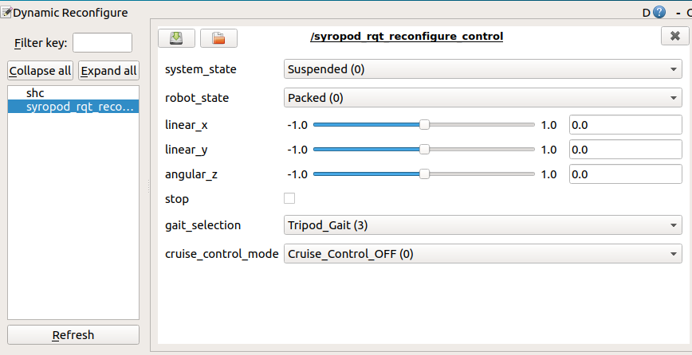

# How to use Syropod RQT Reconfigure Control

[](https://research.csiro.au/robotics/)

[Back to the main page](README.md)

Syropod rqt reconfigure control is an interface between user input via RQT Reconfigure Graphical User Interface (GUI) and the Syropod High-level Controller (SHC)

* For using syropod rqt reconfigure control clone the package to the src folder in your workspace by,

  ```bash
    git clone https://github.com/csiro-robotics/syropod_rqt_reconfigure_control.git
  ```

* Compile the workspace using catkin build.

* Source the devel/setup.bash file from your workspace.

  ```bash
    source ~/openshc_ws/devel/setup.bash
  ```

* Launch the syropod highlevel controller alongside with the rqt reconfigure interface by,

  ```bash
    roslaunch frankenX_syropod frankenX_highlevel.launch control:=rqt rviz:=true
  ```

* Control the syropod in the rviz simulation environment (or in the Gazebo simulation environment with gazebo:=true argument in the above command) using the sliders and drop down menus.

[//]: # (Insert the embedded link of RQT Reconfigure with Rviz.mp4 here)

* To use syropod rqt reconfigure control with the real hexapod, launch both hardware.launch and highlevel.launch in two terminal windows as follows.

  ```bash
    roslaunch frankenX_syropod frankenX_hardware.launch
    roslaunch frankenX_syropod frankenX_highlevel.launch control:=rqt
  ```

[//]: # (Insert the embedded link of RQT Reconfigure with Real Hexapod.mp4 here)



## Inputs

* System State - Controls SHC system state. Select the system state to be Operational/Suspended from the drop down menu.

* Robot State - Controls the current robot state. Select the robot state to be Packed/Ready/Running from the drop down menu.

* Linear X - Adjust the linear velocity of the hexapod in X direction using the slider from -1 to 1.

* Linear Y - Adjust the linear velocity of the hexapod in Y direction using the slider from -1 to 1.

* Angular Z - Adjust the rotational velocity of the hexapod around Z axis using the slider from -1 to 1.

* Stop - CLick on the tick box to stop the hexapod when moving. Click again to start moving the hexapod.

* Gait Selection - Controls the gait designation of the hexapod. Select the gait from Wave/Amble/Ripple/Tripod gaits using the drop down menu.

* Cruise Control Mode - Select the cruise control mode to be ON/OFF from the drop down menu.

[Back to the main page](README.md)

